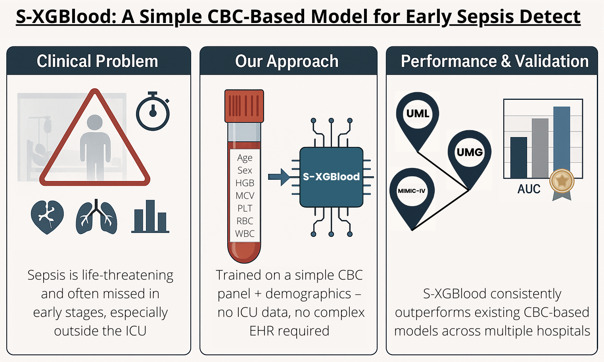
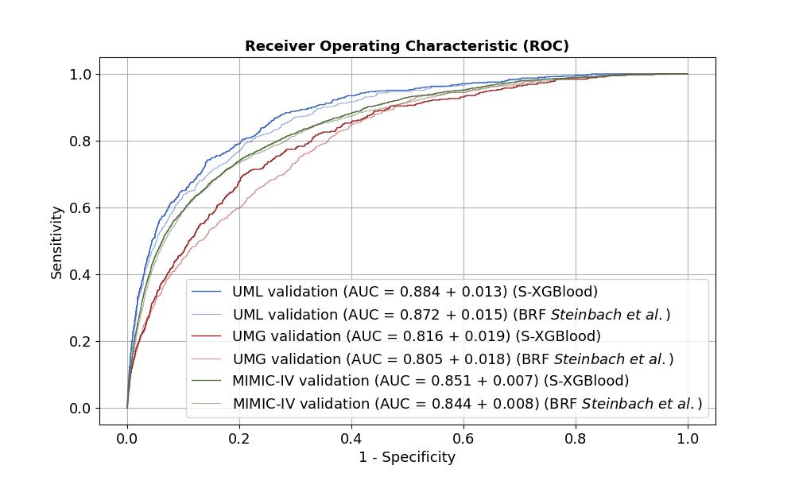
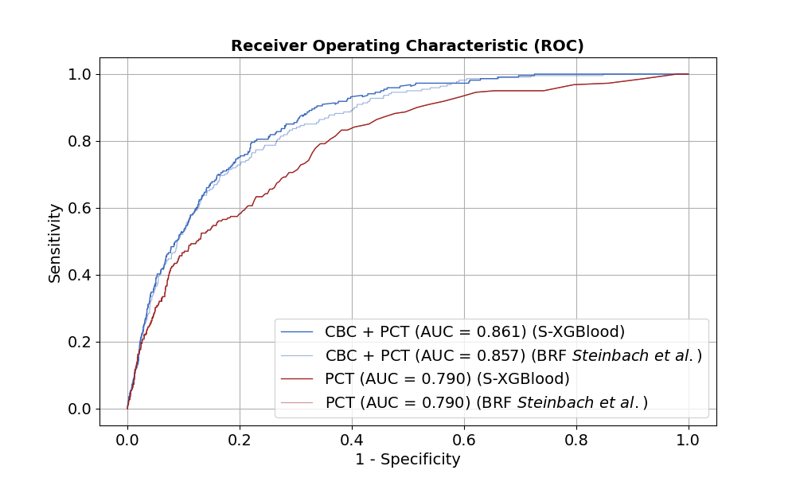
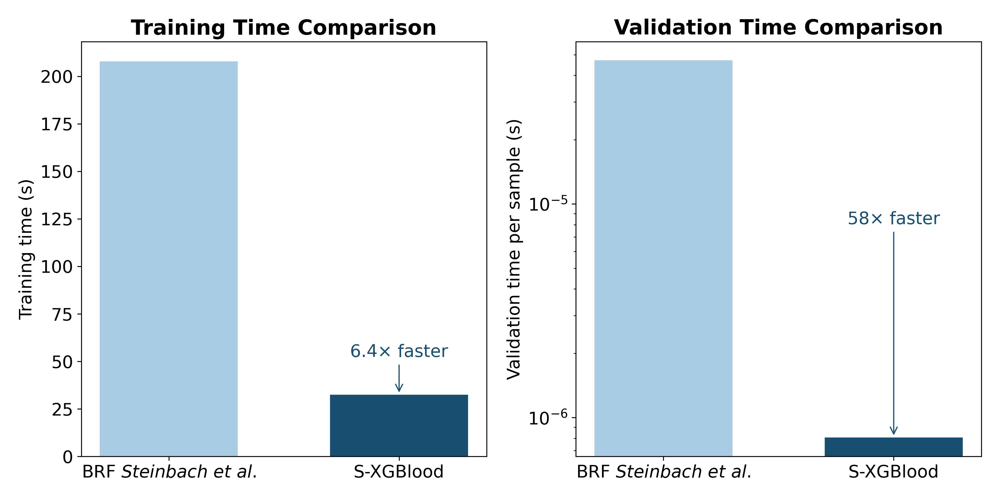
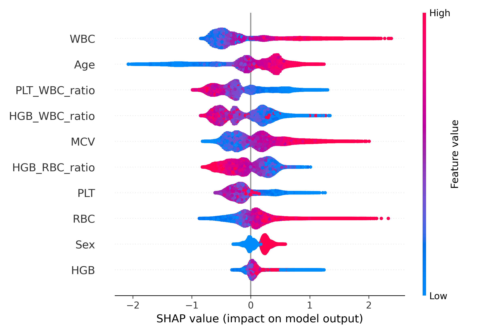
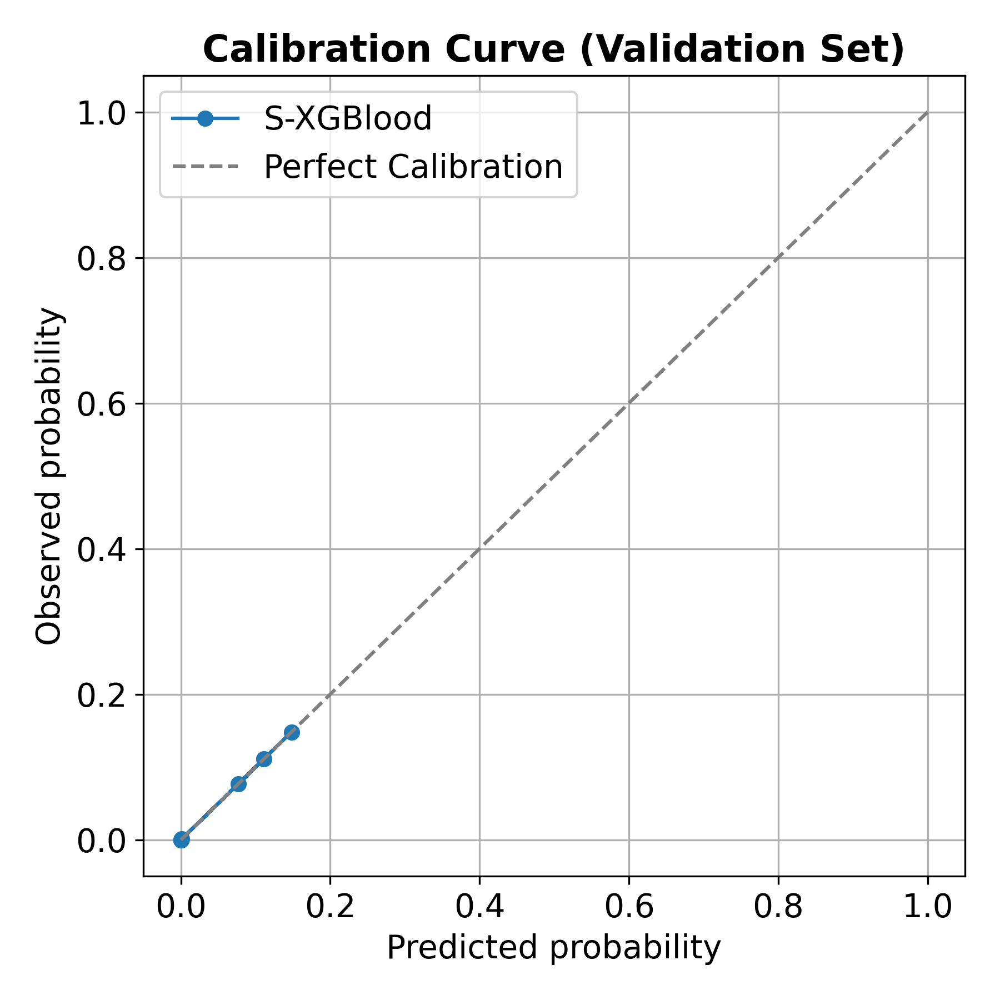

# S-XGBlood: Enhancing Sepsis Prediction with an XGBClassifier-Based Approach Using Complete Blood Count Data

<div align="center">
   
</div>

**Authors:**
*   Laura Escobar Encinas (lauraee@unex.es)
*   Álvaro Rubio-Largo (arl@unex.es)
*   José M. Granado-Criado (granado@unex.es)

*Department of Computer and Communications Technologies & Department of Computers and Telematics Systems Engineering, Universidad de Extremadura, Escuela Politécnica, Cáceres, Spain.*

---

## Overview

S-XGBlood is an XGBoost-based machine learning model designed for the **early detection of sepsis** using only routinely collected Complete Blood Count (CBC) parameters, patient age, and sex. This work builds upon and significantly enhances previous CBC-only approaches, offering a simple, efficient, and clinically relevant tool for identifying patients at risk of sepsis.

Sepsis is a life-threatening condition triggered by the body's dysregulated response to an infection, leading to organ dysfunction and potentially death. Early detection is critical for timely intervention and improved patient outcomes. However, many current predictive models rely on complex data often unavailable outside intensive care units (ICUs) or in resource-limited settings. S-XGBlood addresses this gap by leveraging readily available, low-cost laboratory data.

This repository provides the source code and resources related to the research paper: *"Enhancing Sepsis Prediction with S-XGBlood: An XGBClassifier-Based Approach Using Complete Blood Count Data"*.

## Key Features & Contributions

*   **Simplicity & Accessibility:** Utilizes only 5 CBC parameters (hemoglobin, MCV, platelets, RBC, WBC), age, and sex. No complex EHR data or ICU-specific measurements are required for the model's input.
*   **Enhanced Performance:** S-XGBlood consistently outperforms a state-of-the-art CBC-only sepsis prediction model (Steinbach et al., 2024) across multiple, diverse validation cohorts.
*   **Robust Validation:** Rigorously trained on the University Medicine Leipzig (UMLT) dataset and validated on:
    *   An internal temporal hold-out set (UMLV)
    *   An external German tertiary care center cohort (UMG)
    *   The large, public MIMIC-IV critical care database
*   **Computational Efficiency:** Demonstrates significantly faster training and prediction times, making it highly suitable for real-time deployment in clinical decision support systems.
*   **Interpretability & Calibration:** Offers insights into feature contributions via SHAP analysis and provides well-calibrated probability estimates.
*   **Advanced Techniques:** Incorporates a custom oversampling strategy to handle class imbalance and explores the utility of clinically relevant CBC-derived ratios (HGB/WBC, HGB/RBC, PLT/WBC).

## Core Methodology

S-XGBlood integrates three core elements:
1.  The predictive power of the **XGBoost algorithm**.
2.  A custom **oversampling scheme** to accurately restore class balance during training.
3.  The inclusion of **CBC-derived ratios** to capture key hematological interactions potentially indicative of sepsis.

The model was trained on non-ICU admission data from a German tertiary center (UMLT, 2014-2019), where the sepsis ground truth was established based on subsequent ICU admission for sepsis.

## Performance Highlights

S-XGBlood demonstrates superior discriminative ability (AUC) and robustness across various clinical settings.

**Comparative ROC Curves (S-XGBlood vs. Steinbach et al. 2024):**
*This figure illustrates S-XGBlood's consistent outperformance across the UMLV, UMG, and MIMIC-IV validation cohorts.*


<div align="center">
   
</div>


*Figure 1: ROC curves for the UML, UMG and MIMIC-IV validation cohorts comparing the performance of S‑XGBlood and the Steinbach et al. model.*

**Impact of Procalcitonin (PCT):**
*While S-XGBlood is primarily designed as a CBC-only model, we also evaluated its performance when supplemented with PCT, a known sepsis biomarker. The combined model (CBC+PCT) further enhances diagnostic accuracy.*

<div align="center">
   
</div>

*Figure 2: ROC curves in the UML cohort comparing S‑XGBlood and the Steinbach et al. model using CBC + PCT and only PCT.*

**Computational Efficiency:**
*S-XGBlood is significantly faster in both training and validation compared to the reference model.*

<div align="center">
   
</div>

*Figure 10: Comparison of computational runtime between the BRF model of Steinbach et al. and S-XGBlood for training and validation.*

**Feature Importance (SHAP Summary):**
*Understanding which features drive the model's predictions is crucial for clinical trust and interpretability.*

<div align="center">
   
</div>

*Figure 11: SHAP summary plot showing the contribution of each CBC-derived feature, age, and sex to the model output.*

**Model Calibration:**
*S-XGBlood produces well-calibrated probabilities, meaning its predicted risk scores closely match observed event frequencies.*

<div align="center">
   
</div>

*Figure 12: Calibration curve of the S-XGBlood model on the validation set, showing observed versus predicted probabilities.*

## Purpose of this Repository

This repository aims to:
*   Provide the research community with the means to reproduce our findings.
*   Offer a foundation for further development and application of S-XGBlood.
*   Promote open science in the field of machine learning for healthcare.

---

## Repository Content

This repository contains:
*   **Python scripts** for:
    *   Training the S-XGBlood model using CBC data (`training_CBC.py`).
    *   Training the S-XGBlood model using CBC data plus Procalcitonin (PCT) (`training_CBC_PCT.py`).
    *   Performing seed stability analysis (`seed_analysis.py`).
*   **Sample data or instructions** on how to obtain the required datasets (see "Data Acquisition" below).
*   This `README.md` file.

## Prerequisites & Installation

Before running the scripts, ensure you have the following installed:
*   Python (e.g., version 3.8 or higher).
*   Necessary Python libraries. You can typically install them using pip:
    ```bash
    pip install numpy pandas scikit-learn xgboost joblib
    ```
    It is highly recommended to use a virtual environment (e.g., `venv` or `conda`) to manage dependencies.

## Data Acquisition

The model training and validation require specific datasets. The primary datasets used in our study are:

1.  **`data_le.csv`**: University Medicine Leipzig (UML) training data.
2.  **`data_le_val.csv`**: University Medicine Leipzig (UML) validation data.
3.  **`data_gw.csv`**: University Medicine Greifswald (UMG) external validation data.
4.  **`data_mi.csv`**: MIMIC-IV external validation data.

The datasets from the University Medical Center Leipzig (UML) and University Medical Center Greifswald (UMG), as well as a conversion function for the MIMIC-IV data, are provided as an R package by Steinbach et al. (2024) and can be accessed here:
*   **sbcdata R package:** [https://github.com/ampel-leipzig/sbcdata](https://github.com/ampel-leipzig/sbcdata)
    *   DOI: 10.5281/zenodo.6922968

The MIMIC-IV dataset itself requires credentialed access:
*   **MIMIC-IV:** Johnson A, Bulgarelli L, Pollard T, Horng S, Celi LA, Mark R. MIMIC-IV (version 1.0). PhysioNet. 2021. [https://doi.org/10.13026/s6n6-xd98](https://doi.org/10.13026/s6n6-xd98)

**Note:** You will need to process the data obtained from these sources into the specified CSV formats (`data_le.csv`, `data_le_val.csv`, etc.) or adapt the scripts to read directly from the R package outputs or your local MIMIC-IV data structure. Please refer to our paper and the `sbcdata` package documentation for details on data structure and preprocessing.

## Execution Instructions

1.  **Obtain and Prepare the Datasets:**
    *   Follow the instructions in the "Data Acquisition" section to get the necessary data.
    *   Ensure the data files (`data_le.csv`, `data_le_val.csv`, `data_gw.csv`, `data_mi.csv`) are placed in the expected directory or update the paths in the scripts accordingly.

2.  **Run the Training Scripts:**
    *   To train the S-XGBlood model using only CBC data:
        ```bash
        python training_CBC.py
        ```
    *   To train the S-XGBlood model using CBC data plus Procalcitonin (PCT):
        ```bash
        python training_CBC_PCT.py
        ```
    These scripts will typically perform hyperparameter optimization using Optuna, train the final model, and save relevant outputs (e.g., trained model, performance metrics).

3.  **Run the Seed Stability Analysis:**
    *   To evaluate the model's robustness to random initialization:
        ```bash
        python seed_analysis.py
        ```
    This script will likely retrain and evaluate the model multiple times with different random seeds and report aggregated performance.

*(Please ensure that the scripts are configured with correct paths to data and output directories. You might need to modify parts of the scripts if your environment or data setup differs.)*

## Citation

If you use S-XGBlood or this codebase in your research, please cite our paper:

```bibtex
@article{EscobarEncinas2024SXGBlood,
  title={Enhancing Sepsis Prediction with S-XGBlood: An XGBClassifier-Based Approach Using Complete Blood Count Data},
  author={Escobar Encinas, Laura and Rubio-Largo, Álvaro and Granado-Criado, José M.},
  journal={Knowledge-Based Systems}, 
  year={2025}, 
}
```

## Acknowledgements

The authors would like to thank the contributors to the MIMIC-IV database, University Medicine Leipzig, and University Medicine Greifswald for making their data available for research. We also acknowledge the work of Steinbach et al. (2024) which provided a valuable benchmark for our study.

We thank the Fundación Valhondo Calaff for the financial support provided to Laura Escobar-Encinas for carrying out this research. This work was also partially supported by the MCIN (Ministry of Science and Innovation, Spain), the AEI (State Research Agency, Spain), and the ERDF (European Regional Development Fund, EU), under the project PID2022-137275NA-I00 funded by MCIN/AEI/10.13039/501100011033\\/FEDER, EU (X-BIO project).
